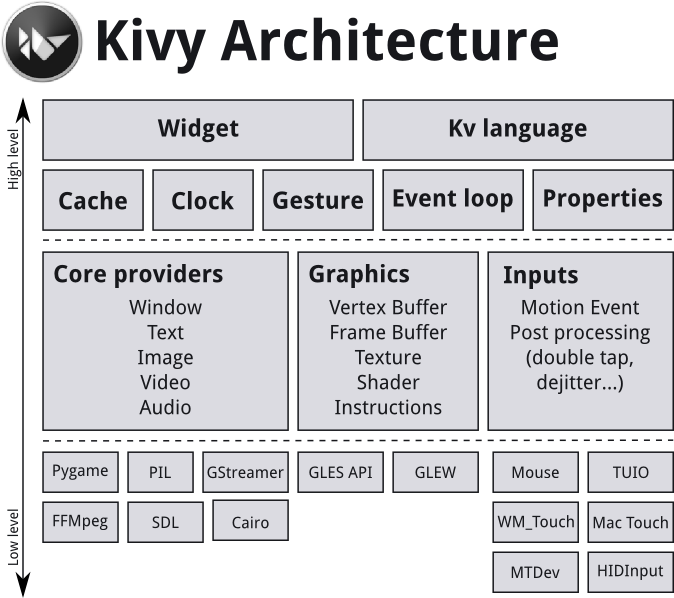

# KivyBoilerPlateApplication [TEMPLATE]
### by Morgan Van V.
This repository contains a basic Kivy application template for rapid prototyping and development.
The goal of this is to have a forkable repo that provides a solid, clean foundation for my own future potential projects,
as well as anyone else who might have interest.

Feel free to open issues, pull requests, provide suggestions, or get in contact.

## Format / Foundation
Add images here to display what this application looks like when built. Basic Kivy & KivyMD Navigation Drawer
multipage layout.

**Currently Implemented Features:**
   
   - Basic Multi-Page Navigation using KivyMD (ScreenManager, MDToolbar, & MDNavigationDrawer)
   - Settings Panel for user-defined settings as well as default Kivy settings
   - Basic Logging using Kivy Logger class
   - Theming from KivyMD as well as an example custom font definition

## How to use:
1. install dependencies from requirements.txt 
2. run main.py file found in:
        
        ./src/main_app/main.py

## TODO:
1. README always needs updating and prettifying
2. GitHub Actions & Deployment Pipeline
3. IMPLEMENT SERVER: https://kivy.org/doc/stable/guide/other-frameworks.html 
    (twisted reactor? maybe should exist on separate branch considering differing use cases)
4. Add basic Components and styling to each page to show off different functionalities

## A Crash Course / Reference on Kivy & KivyMD

Here are some notes for the user, (as well as for my later reference), regarding Kivy and KivyMD
Consider this a crash course of sorts.

_**Full Documentation PDF**: https://buildmedia.readthedocs.org/media/pdf/kivy/latest/kivy.pdf_

_**Kivy Website Documentation**: https://kivy.org/doc/stable/_

_**KivyMD Website Documentation**: https://kivymd.readthedocs.io/en/latest/_

### Kivy App Architecture

_https://kivy.org/doc/stable/guide/architecture.html_

### Kivy App Lifecycle

      Python start, run() -> build() -> on_start() -> APP FUNCTIONS -> on_stop() -> KIVY WINDOW DESTROYED

   We can also use `on_pause()` and `on_resume()` to do self-explanatory things

### Kivy Event Loop (KIVY_EVENTLOOP)

   When the app is run in an asynchronous manner, library `asyncio` package should be used

   `trio` is mentioned in the documentation but `asyncio` is a more mature, maintained package

## Documentation Links and Overview
### Kivy Application Class: https://kivy.org/doc/stable/api-kivy.app.html#module-kivy.app
The App class is the base for creating Kivy applications. Think of it as your main entry point into the Kivy run loop. In most cases, you subclass this class and make your own app. You create an instance of your specific app class and then, when you are ready to start the application’s life cycle, you call your instance’s App.run() method.

### Kivy Configuration: https://kivy.org/doc/stable/api-kivy.config.html#module-kivy.config
The Config object is an instance of a modified Python ConfigParser. See the ConfigParser documentation for more information.

Kivy has a configuration file which determines the default settings. In order to change these settings, you can alter this file manually or use the Config object. Please see the Configure Kivy section for more information.

### Kivy Factory: https://kivy.org/doc/stable/api-kivy.factory.html
_The factory can be used to automatically register any class or module and instantiate classes from it anywhere in your project._

### Kivy Base: https://kivy.org/doc/stable/api-kivy.base.html
This module contains the Kivy core functionality and is not intended for end users. Feel free to look through it, but bare in mind that calling any of these methods directly may result in an unpredictable behavior as the calls access directly the event loop of an application.

### Kivy Logger: https://kivy.org/doc/stable/api-kivy.logger.html
The Kivy Logger class provides a singleton logger instance. This instance exposes a standard Python logger object but adds some convenient features.

All the standard logging levels are available : trace, debug, info, warning, error and critical.

### Kivy Metrics: https://kivy.org/doc/stable/api-kivy.metrics.html
A screen is defined by its physical size, density and resolution. These factors are essential for creating UI’s with correct size everywhere.

### Kivy Properties: https://kivy.org/doc/stable/api-kivy.properties.html
The Properties classes are used when you create an EventDispatcher.
Kivy’s property classes support: Value Checking / Validation, Observer Patterns, Better Memory Management

### Kivy Resource Management: https://kivy.org/doc/stable/api-kivy.resources.html
Resource management can be a pain if you have multiple paths and projects. Kivy offers 2 functions for searching for specific resources across a list of paths.

### Kivy Core Abstraction: https://kivy.org/doc/stable/api-kivy.core.html
This module defines the abstraction layers for our core providers and their implementations. For further information, please refer to Architectural Overview and the Core Providers and Input Providers section of the documentation.
